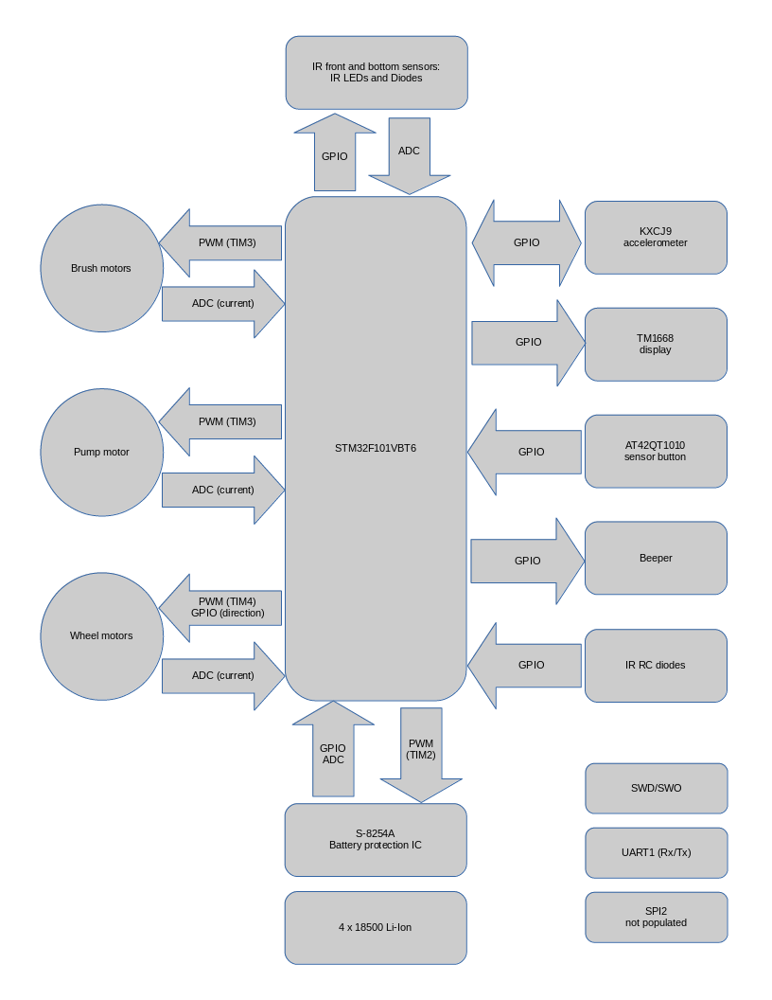
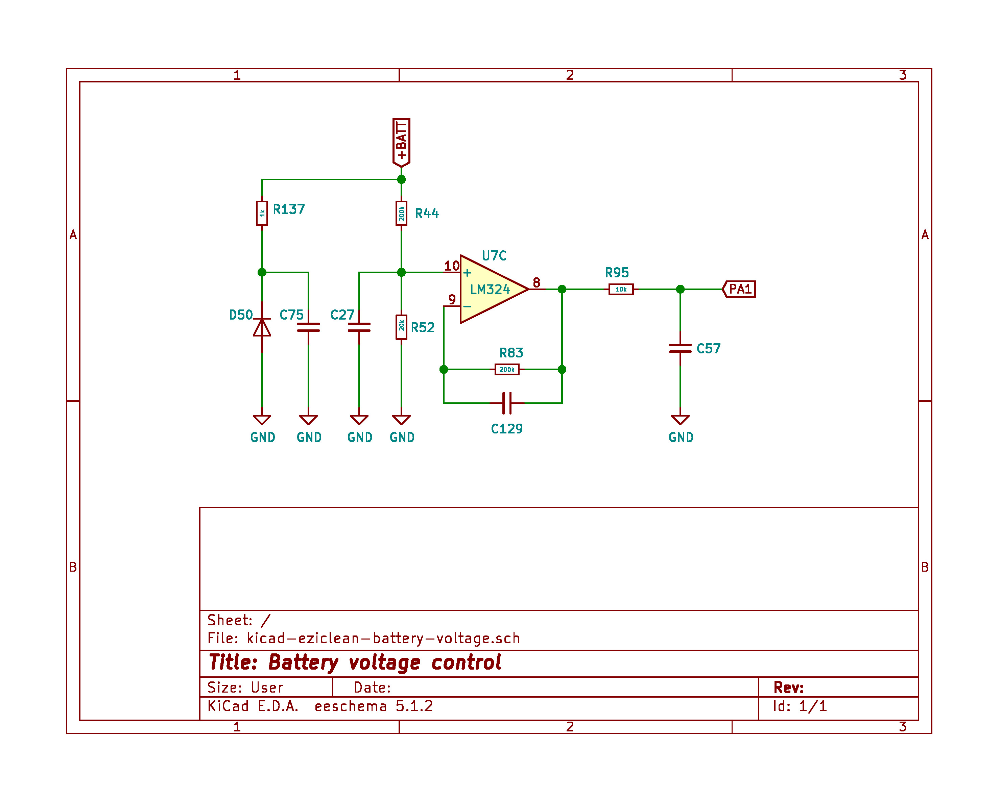
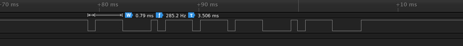
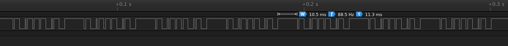
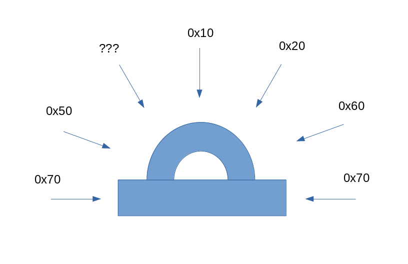

# Summary
Experiments with custom firmware for [E.ZICLEAN CUBE](https://www.e-zicom.com/aspirateur-robot-eziclean-cube.html) robot vacuum cleaner.
# Quick start guide
## Firmware
Build experimental firmware images based on [stm32f1xx-hal](https://crates.io/crates/stm32f1xx-hal):
```bash
$ cargo build --bins --release
```
## Examples: stm32hal
Build examples based on [stm32f1xx-hal](https://crates.io/crates/stm32f1xx-hal):
```bash
$ cargo build --examples --release
```
## Examples: stm32ral
Build examples based on [stm32ral](https://crates.io/crates/stm32ral):
```bash
$ cargo build --features ral --no-default-features --examples
```

## Hardware
### Board


### Components
* Microcontroller STM32f101VBT6
* Accelerometer KXCJ9
* 3 operational amplifiers LM324
* Quad buffer/line driver 74HC125D
* Display driver TM1668
* One-channel touch sensor AT42QT1010
* 4-serial-cell Li-Ion rechargeable batteries controlled by S-8254A battery protection IC

### Hardware diagram


#### Notes
* Accelerometer and display
  * GPIO for SCL/SDA/INT and DIO/STB/CLK respectively
  * note that devices connected to GPIO rather than to h/w I2C and SPI blocks, so GPIO bitbang is used
* IR front/bottom sensors
  * GPIO to enable/disable IR LEDs
  * ADC to read IR diode voltage
* Brush/pump motors
  * PWM to control rotation speed
  * ADC to control [current consumption](#current-control-for-dc-motors)
* Wheel motors
  * PWM to control rotation speed
  * GPIO to control [direction](#wheel-motors-control)
  * ADC to control current consumption
* Battery management circuit
  * PWM to charge battery
  * GPIO to detect battery presence
  * ADC to control [battery voltage](#battery-voltage-control) and [charging current](#charger-control)
  
### Hardware investigation status
- [x] SWD debug port
- [x] 5 front infrared obstacle sensors
- [x] 3 bottom infrared floor sensors
- [x] infrared remote control: protocol and commands
- [x] dock station infrared beacons: protocol and commands
- [x] sensor button
- [x] display
- [x] beeper
- [x] accelerometer
- [x] 2 brush motors
- [x] pump motor
- [x] 2 wheel motors, their direction control and encoders
- [x] charger connector and presence detection
- [x] dock station connector and presence detection
- [x] battery presence detection
- [x] battery voltage control circuit
- [x] battery current control circuit
- [x] brush motors current control circuit
- [x] pump motor current control circuit
- [ ] wheel motors current control circuit
- [ ] battery charging circuit

### Connector pinout
| VDD (75) | TMS/SWD (72) | GND | TDI (77) | NTRST (90)|
|-|-|-|-|-|
|__TX (68)__| __RX (69)__ | __TDO/TRACESWO (89)__ | __TCK/SWCLK (76)__ | __NRST (14)__|

### Runtime pin configuration

#### GPIOA

| Pin | Configuration | Mapping | Function |
|-|-|-|-|
| PA0 | analog input | ADC_IN0 | NC ??? |
| PA1 | analog input | ADC_IN1 | battery [voltage](#battery-voltage-control) control |
| PA2 | analog input | ADC_IN2 | battery [charging current](#charger-control) control |
| PA3 | analog input | ADC_IN3 | NC ??? |
| PA4 | analog input | ADC_IN4 | IR diode of the left-center front sensor |
| PA5 | analog input | ADC_IN5 | Connected to op-amp U5 (LM324): seems to be a [current control](#current-control-for-wheel-motors) circuitry of left wheel motor|
| PA6 | analog input | ADC_IN6 | IR diode of the center-center front sensor |
| PA7 | analog input | ADC_IN7 | IR diode of the central floor sensor |
| PA8 | floating input | | |
| PA9 | floating input | | J31 (TX) |
| PA10 | floating input | | J31 (RX) |
| PA11 | general purpose output (50MHz) push-pull | | TM1668 STB |
| PA12 | floating input | | |
| PA13 | input with pull-up/pull-down | | J31 (SWDIO) |
| PA14 | input with pull-up/pull-down | | J31 (SWCLK) |
| PA15 | general purpose output (50MHz) push-pull | | J31 (TDI) |

#### GPIOB

| Pin | Configuration | Mapping | Function |
|-|-|-|-|
| PB0 | analog input | ADC_IN8 | IR diode of the right-right front sensor |
| PB1 | analog input | ADC_IN9 | IR diode of the right floor sensor |
| PB2 | general purpose output (50MHz) push-pull | | KXCJ9 SDA |
| PB3 | floating input | | TDO/TRACESWO pin on J31 |
| PB4 | alternate function output (50MHz) push-pull | TIM3_CH1 | pump motor: must remap AFIO/SWJ_CFG since default configuration of PB4 is NJTRST |
| PB5 | alternate function output (50MHz) push-pull | TIM3_CH2 | all 3 brushes |
| PB6 | alternate function output (50MHz) push-pull | TIM4_CH1 | left wheel reverse speed (TIM4/PWM via 74HC125D 2A) |
| PB7 | alternate function output (50MHz) push-pull | TIM4_CH2 | left wheel forward speed (TIM4/PWM via 74HC125D 1A) |
| PB8 | alternate function output (50MHz) push-pull | TIM4_CH3 | right wheel forward speed (TIM4/PWM via 74HC125D 4A) |
| PB9 | alternate function output (50MHz) push-pull | TIM4_CH4 | right wheel reverse speed (TIM4/PWM via 74HC125D 3A) |
| PB10 | alternate function output (50MHz) push-pull | TIM2_CH3 | PWM for [battery charging](#charger-control) |
| PB11 | general purpose output (50MHz) open-drain | | right wheel reverse [control](#wheel-motors-control) |
| PB12 | general purpose output (50MHz) push-pull | | SPI2_NSS for U12 (non-populated) |
| PB13 | general purpose output (50MHz) push-pull | | SPI2_SCK for U12 (non-populated) |
| PB14 | general purpose output (50MHz) push-pull | | SPI2_MISO for U12 (non-populated) |
| PB15 | floating input | | SPI2_MOSI for U12 (non-populated) |

#### GPIOC

| Pin | Configuration | Mapping | Function |
|-|-|-|-|
| PC0 | analog input | ADC_IN10 | IR diode of the left-left front sensor |
| PC1 | analog input | ADC_IN11 | IR diode of the left floor sensor |
| PC2 | analog input | ADC_IN12 | [Current control](#current-control-for-dc-motors) for brush motors|
| PC3 | analog input | ADC_IN13 | [Current control](#current-control-for-dc-motors) for air pump motor|
| PC4 | analog input | ADC_IN14 | Connected to op-amp U6 (LM324): seems to be a [current control](#current-control-for-wheel-motors) circuitry of right wheel motor|
| PC5 | analog input | ADC_IN15 | IR diode of the right-center front sensor |
| PC6 | floating input | | |
| PC7 | general purpose output (50MHz) push-pull | | IR LEDs of all 5 front IR obstacle sensors |
| PC8 | general purpose output (50MHz) push-pull | | TM1668 CLK |
| PC9 .. PC10 | floating input | | |
| PC11 | floating input | | RC IR: left diode |
| PC12 | floating input | | IR diode in left motor optical incremental encoder |
| PC13 .. PC15 | floating input | | |

#### GPIOD

| Pin | Configuration | Mapping | Function |
|-|-|-|-|
| PD0 | floating input | | |
| PD1 | floating input | | sensor button: AT42QT1010 output |
| PD2 | general purpose output (50MHz) open-drain | | left wheel forward [control](#wheel-motors-control) |
| PD3 | floating input | | |
| PD4 | general purpose output (50MHz) push-pull | | |
| PD5 | general purpose output (50MHz) open-drain | | left wheel reverse [control](#wheel-motors-control) |
| PD6 .. PD8 | floating input | | |
| PD9 | general purpose output (50MHz) push-pull | | IR LEDs of all 3 bottom IR floor sensors |
| PD10 | floating input | | |
| PD11 | floating input | | RC IR: front diode |
| PD12 | floating input | | |
| PD13 | general purpose output (50MHz) open-drain | | IR LEDs in optical incremental encoders for both main motors, active low |
| PD14 | general purpose output (50MHz) push-pull | | TM1668 DIO |
| PD15 | floating input | | RC IR: top diode |

#### GPIOE

| Pin | Configuration | Mapping | Function |
|-|-|-|-|
| PE0 | general purpose output (50MHz) push-pull | | Beeper |
| PE1 .. PE3 | floating input | | NC ??? |
| PE4 | floating input | | [charge connector](#charger-control) detection |
| PE5 | floating input | | [charge dock station](#charger-control) detection |
| PE6 | floating input | | [battery presence](#charger-control) detection |
| PE7 | general purpose output (50MHz) push-pull | | KXCJ9 SCL |
| PE8 | floating input | | IR diode in right motor optical incremental encoder |
| PE9 | floating input | | KXCJ9 INT |
| PE10 | floating input | | RC IR: right diode |
| PE11 | floating input | | NC ??? |
| PE12 | general purpose output (50MHz) open-drain | | Enable power for IR RC left/front/right diodes (via R22 and Q7) |
| PE13 | floating input | | NC ??? |
| PE14 | general purpose output (50MHz) open-drain | | right wheel forward [control](#wheel-motors-control) |
| PE15 | general purpose output (50MHz) push-pull | | NC ??? |

### [Wheel motors control](#wheel-motors-control)
From PCB investigation, it looks like SR-latch circuit is used for direction control to protect H-bridges for main motors.

Right motor direction is controlled by PE14 and PB11:

| PE14 | PB11 | Direction |
|-|-|-|
|  0   |   0  |  stop |
|  1   |   0  |  reverse |
|  0   |   1  |  forward |
|  1   |   1  |  stop |

Left motor direction is controlled by PD2 and PD5:

| PD2  | PD5  | Direction |
|-|-|-|
|  0   |   0  |  stop |
|  1   |   0  |  reverse |
|  0   |   1  |  forward |
|  1   |   1  |  stop |

### [Current control circuit for brush/pump motors](#current-control-for-dc-motors)
From PCB investigation, schematics looks as follows:


### [Battery voltage control circuit](#battery-voltage-control)
From PCB investigation, schematics looks as follows:


### [Battery charger circuit](#charger-control)
From PCB investigation, schematics looks as follows:


### [Current control for wheel motors](#current-control-for-wheel-motors)
Schematics: TODO

### Input GPIO pins and EXTI lines budget
| Function | GPIO | EXTI line | EXTI interrupt | Comments |
|-|-|-|-|-|
| KXCJ9 INT | PE9 | EXTI9 | EXTI9_5 ||
| TOP IR RC diode | PD15 | EXTI15 | EXTI15_10 ||
| Left IR RC diode | PC11 | EXTI11 | EXTI15_10 | Only one Px11 GPIO pin can be selected for EXTI11 line |
| Front IR RC diode | PD11 | EXTI11 | EXTI15_10 | Only one Px11 GPIO pin can be selected for EXTI11 line |
| Right IR RC diode | PE10 | EXTI10 | EXTI15_10 | |
| Button | PD1 | EXTI1 | EXTI1 | |
| Left wheel encoder | PC12 | EXTI12 | EXTI15_10 | |
| Right wheel encoder | PE8 | EXTI8 | EXTI9_5 | |
| Charger detect | PE4 | EXTI4 | EXTI4 | |
| Dock detect | PE5 | EXTI5 | EXTI9_5 | |
| Battery detect | PE6 | EXTI6 | EXTI9_5 | |

Note that left and front IR remote control diodes are connected to PC11 and PD11 respectively. As a result, both these GPIO lines are attached to the same EXTI11 line and only one of them can be selected as EXTI source.

### IR controls
#### Remote Control commands
Logic analyzer capture of IR RC _Edge_ button demodulated signal looks as follows:


Capture in csv format is [attached](dumps/ir-rc-capture.csv). This capture does not look like any of the common IR RC protocols, e.g. NEC, RC5, RC6. In fact, it looks like 1-wire protocol w/o initial reset/response phase. Following 1-wire conventions, consider short low level pulse as '1' and long low level pulse as '0'. As a result, the following table of key codes is obtained:

| Function | Name | Code | Comments |
|-|-|-|-|
| Button | _ON/OFF_ | 0x1d | |
| Button | _SCHED_ | 0x4d | |
| Button | _TIME_ | 0x2d | |
| Button | _UP_  | 0x3d | |
| Button | _DOWN_ | 0x6d | |
| Button | _LEFT_ | 0x5d | |
| Button | _RIGHT_ | 0x7d | |
| Button | _EDGE_ | 0x5d | same as _LEFT_ |
| Button | _DOCK_ | 0x1d | same as _ON/OFF_ |
| Button | _SPOT_ | 0x6d | same as _DOWN_ |
| Button | _CLEAN_ | 0x3d | same as _UP_ |

If button on IR RC device is pressed and not released, then IR RC command is sent continuously, approximately 10-12 msec between two consequent transmissions. Here is a capture of demodulated signal: 


#### Dock station beacons
Dock station sends beacons continuously, approximately ~32 msec between consequent beacons. Here is a capture of demodulated signal:


Dock uses the same protocol similar to 1-wire  as IR RC device. Beacon code depends from viewing angle:



## Firmware
### Status of firmware building blocks
- [x] [5 front infrared obstacle sensors](examples/hal/example-hal-adc-sensors.rs)
- [x] [3 bottom infrared floor sensors](examples/hal/example-hal-adc-sensors.rs)
- [x] [infrared remote control](examples/hal/example-hal-ir-rc-test4.rs)
- [x] [dock station infrared beacons: protocol and commands](examples/hal/example-hal-ir-rc-test4.rs)
- [x] [sensor button](examples/hal/example-hal-sensor-button.rs)
- [x] [display](examples/hal/example-hal-i2c-disp-test2.rs)
- [x] [beeper](examples/ral/example-ral-beep.rs)
- [x] [KXCJ9 accelerometer](examples/hal/example-hal-i2c-acc-test2.rs)
- [x] [2 brush motors](examples/hal/example-hal-pwm-brushes.rs)
- [x] [pump motor](examples/hal/example-hal-pwm-brushes.rs)
- [x] [2 wheel motors, their speed and encoders](examples/hal/example-hal-pwm-wheels.rs)
- [x] [2 wheel motors, their encoders](examples/hal/example-hal-wheel-encoders.rs)
- [x] [charger connector presence detection](examples/hal/example-hal-pwr.rs)
- [x] [dock station connector presence detection](examples/hal/example-hal-pwr.rs)
- [x] [battery presence detection](examples/hal/example-hal-pwr.rs)
- [x] [battery voltage control circuit](examples/hal/example-hal-pwr.rs)
- [x] [battery current control circuit](examples/hal/example-hal-pwr.rs)
- [ ] brush motors current control circuit
- [ ] pump motor current control circuit
- [ ] wheel motors current control circuit
- [ ] battery charging circuit

### Firmware diagram
TODO
